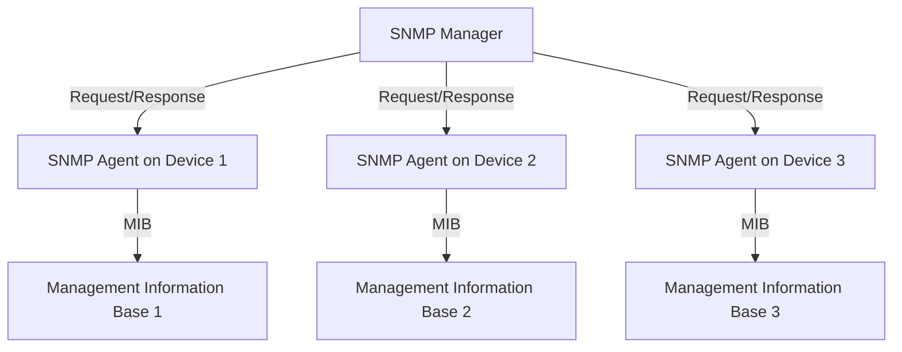
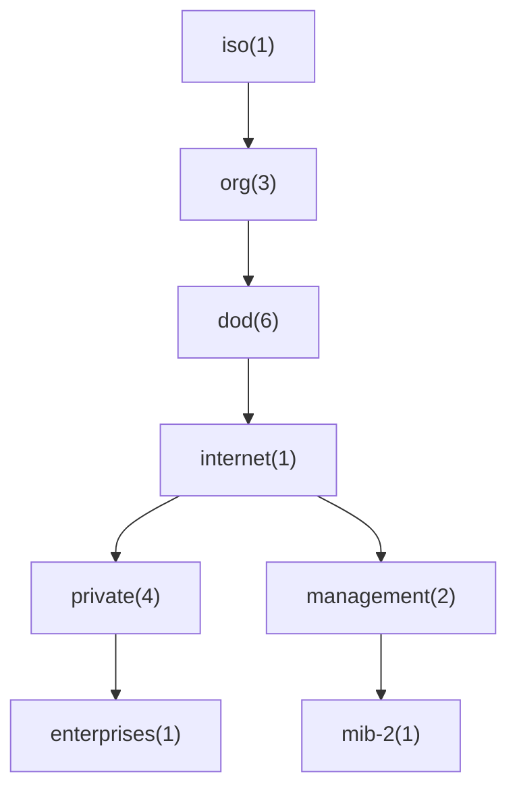

## What is SNMP?

SNMP is an application-layer protocol defined by the Internet Architecture Board (IAB) in RFC1157 for exchanging management information between network devices. It is part of the Internet Protocol Suite as defined by the Internet Engineering Task Force (IETF).

## Key Components of SNMP

SNMP consists of the following key components:

1. **Managed Devices:** These are network nodes such as routers, switches, servers, workstations, printers, modem racks, etc., that are monitored and controlled using SNMP.
2. **Agents:** These are software modules that reside on managed devices. An agent has local knowledge of management information and translates that information into a form compatible with SNMP.
3. **Network Management Station (NMS):** These are systems used to control and monitor the activities of network devices using SNMP. NMS executes applications that monitor and control managed devices.

## SNMP Architecture

SNMP operates using a manager-agent architecture. The manager is a central system that oversees the network, and agents are distributed across the managed devices. Here’s a simplified view of the SNMP architecture:



1. **Manager:** This component runs the SNMP management software, which communicates with the SNMP agents on the network devices to collect and analyze data.
2. **Agent:** An SNMP agent is a software component within the network device. It maintains local management information and reports this data, in the form of variables, to the SNMP manager.
3. **Management Information Base (MIB):** MIB is a virtual database containing definitions of the network objects that can be managed using SNMP. Each managed object in a MIB has a unique identifier called an Object Identifier (OID).

## Object Identifiers (OIDs)

An Object Identifier (OID) is a globally unique identifier used in SNMP to name variables, which represent the properties of managed devices. OIDs are structured hierarchically, similar to a directory tree. They are defined by international standards organizations and assigned by IANA (Internet Assigned Numbers Authority).

For example:
- The OID for system description: `1.3.6.1.2.1.1.1`
- The OID for system uptime: `1.3.6.1.2.1.1.3.0`

## How SNMP Works

SNMP operates over the User Datagram Protocol (UDP). It uses a simple request/response mechanism:

1. **The manager sends a request to the agent.**
2. **The agent receives the request, processes it, and sends a response back to the manager.**

The basic operations performed by SNMP include:

- **GET:** The manager requests information from the agent.
- **SET:** The manager sends data to the agent to update the values of variables.
- **GETNEXT:** This operation is used to retrieve the next object in the MIB hierarchy.
- **TRAP:** The agent sends unsolicited information to the manager about certain events.

## SNMP Versions

There are three versions of SNMP:

1. **SNMPv1:** The original version of SNMP, introduced in 1988. It provides basic features for managing network devices but has limited security features.
2. **SNMPv2:** An improved version, introduced in 1993, that includes enhanced performance, security, confidentiality, and manager-to-manager communications. However, SNMPv2 did not achieve widespread use due to its complexity.
3. **SNMPv3:** The latest version, introduced in 2002, which addresses the security concerns of SNMPv1 and SNMPv2 by providing robust security features including authentication, encryption, and access control.

## Practical Applications of SNMP

SNMP is used for various network management tasks, including:

1. **Network Monitoring:** SNMP helps in monitoring network performance, detecting faults, and ensuring that the network runs smoothly.
2. **Device Management:** SNMP can be used to manage network devices such as routers, switches, and servers. It helps in configuring device settings, updating firmware, and monitoring device status.
3. **Troubleshooting:** By providing detailed information about network operations, SNMP aids in identifying and resolving network issues quickly.
4. **Security Management:** SNMPv3’s security features help in managing network security by providing mechanisms for user authentication and data encryption.

## Example: Using SNMP in the Terminal

Let's look at an example of using SNMP commands in the terminal. We'll use the `snmpget` command to query a device for its system description.

### Prerequisites

1. Ensure that SNMP is installed on your system. On a Linux system, you can install it using the following command:

   ```sh
   sudo apt-get install snmp snmpd
   ```

2. Know the IP address of the device you want to query and the community string (default is usually `public`).

### Example Command

To get the system description of a device with IP address `192.168.1.10`, you can use the following command:

```sh
snmpget -v 2c -c public 192.168.1.10 1.3.6.1.2.1.1.1.0
```

- `-v 2c`: Specifies the SNMP version (SNMPv2c in this case).
- `-c public`: Specifies the community string (default is `public`).
- `192.168.1.10`: The IP address of the SNMP agent (device).
- `1.3.6.1.2.1.1.1.0`: The OID for the system description.

### Output

The output will look something like this:

```sh
SNMPv2-MIB::sysDescr.0 = STRING: Linux local.codingroom.in 5.15.0-100-generic #110~20.04.1-Ubuntu SMP Tue Feb 13 14:25:03 UTC 2024 x86_64
```

This indicates that the system description of the queried device is `Linux local.codingroom.in 5.15.0-100-generic`.

## Benefits of Using SNMP

- **Scalability:** SNMP can be used to manage networks of all sizes, from small home networks to large enterprise networks.
- **Interoperability:** SNMP is a standardized protocol, allowing devices from different vendors to be managed in a unified manner.
- **Flexibility:** SNMP can be used to monitor and manage a wide variety of network devices and services.
- **Automation:** SNMP enables the automation of network management tasks, reducing the need for manual intervention.

## Conclusion

SNMP is a powerful and versatile protocol that plays a crucial role in network management. By understanding its components, architecture, and operations, network administrators can effectively use SNMP to monitor and manage their networks, ensuring optimal performance and reliability.

Whether you are managing a small network or a large enterprise infrastructure, SNMP provides the tools necessary to keep your network running smoothly. With its continuous evolution and the introduction of robust security features in SNMPv3, it remains a vital protocol for network management in today's complex and dynamic network environments.